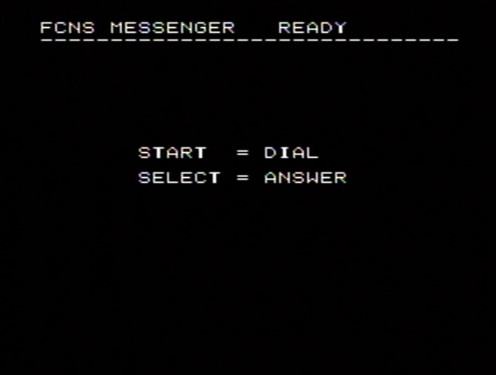
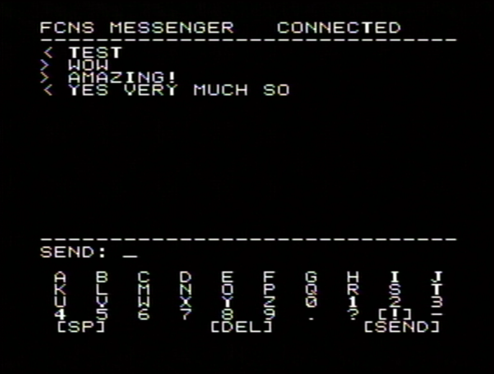

# Famicom Network System Messaging Example




This is a basic example app that demonstrates sending and receiving text messages between two Famicom Network System units connected over a phone line.

## Build

Requires the [llvm-mos](https://github.com/llvm-mos/llvm-mos) toolchain.

```sh
make all
```

Outputs demo.nes, which can be loaded onto a [Flash-FNS](https://github.com/benboldtumd/flash-fns) cart via PLCC-32 ROM chip.

## Hardware

Not everything here is strictly required but this is what I use:

- Two Famicoms with FCNS units (rev11/rev12)
- Two Flash-FNS carts
- T48 programmer for the PLCC-32 ROM chips
- Phone line simulator (Viking DLE-200B/DLE-300) or an actual landline (haven't tested this, but would love to know if it works)
- Phone cables connecting both units with the phone sim or landline connection in the middle

## Usage

1) Load up the ROM on both Famicoms
2) Press the SELECT (<) button on one Famicom to put it in answer mode
3) Press the START (>) button on the other to dial out
4) Once both connect you'll see an on-screen keyboard and message box

You can hang up using the button labeled "通信終了" on the controller (top-right corner), which literally means "End Communication". This is the standard hang up button for FCNS carts.

If you want, you can also change the phone number that gets dialed out by setting `FCNS_NUMBER` at the top of [fcns.h](src/fcns.h).

## Controls

| Button | Action |
|--------|--------|
| START | Dial |
| SELECT | Answer |
| 通信終了 | Hang up |
| A | Select character |
| B | Send |
| C | Delete |
| . | Space |

Also the numpad directly enters numbers.

## How It Works

Placing a call is three steps:
1) Init CPU2 (the chip that handles the modem communication)
2) Configure it to either dial out or wait for a ring, then wait for it to report that the call is up
3) Dial or answer, which are two halves of the same thing and both end in the same place: A plain 1200 baud pipe with a Famicom on each end

Sending a message after that is just handing CPU2 a line of text with a `0x03` byte stuck on the end. That byte is how CPU2 knows the line is finished, so the far end receives whole messages instead of a stream of bytes it would have to cut up itself. Messages coming the other way show up on their own. You don't request them, you just check once a frame whether one arrived.

## Directory Tree

- `src/main.c` - State machine and input handling
- `src/fcns.c` - Dialing, answering, sending and receiving text, hanging up
- `src/chat.c` - The on-screen keyboard, the message box and the message log
- `src/ui.c` - Yes
- `src/ppu.c` - Graphics setup (palette, font)
- `src/keypad.c` - Controller to key code mapping
- `asm/` - Raw 6502 essentials: the mailbox handshake, the keypad reader, the NMI, and the font
